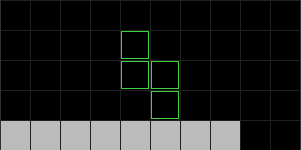
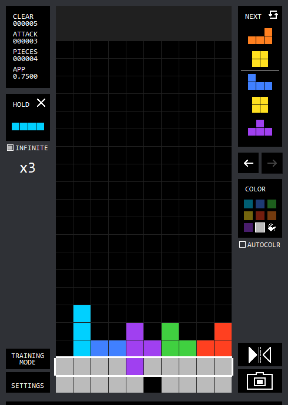

# tetris guide

this little write-up is to educate you on the fundamentals on versus tetris - for a spectator's perspective. so that you can be the most pog shoutcaster ever.

# Pieces

The pieces in Tetris are all made of 4 Minos in different configurations. They are named after the letter they resemble. From left to right in the image above, they are:
- O Tetrimino
- I Tetrimino
- T Tetrimino
- L Tetrimino
- J Tetrimino
- S Tetrimino
- Z Tetrimino

Many people forego using the "Tetrimino" label, and instead just use something simpler (e.g. "the O block" or "the T piece").

# Terminology
- Hard Drop - instantly dropping a piece to the bottom of the stack in its current position and orientation
- Soft Drop - manually moving a piece down, often done for T-Spins / Spins / Tucks
- Misdrop - an error in placing a piece
- CW / CCW - Clockwise / Counter-clockwise (usually used in terms of rotation)
- Passthrough - the buffer time before attacks "reach" your garbage queue
- Downstack - to decrease your stack's height by clearing lines, usually singles / doubles / triples
- SRS - Super Rotation System - the system governing the movement and rotation behaviors of each piece in modern Guideline Tetris games
- DAS / ARR / SDF?

## Bag and Randomizer

Modern Tetris games have a 7-bag randomizer system. This is the way the piece order is determined:

- A random order of the 7 different pieces is generated. This is considered a "bag."
- The player's piece order is that bag.
- For the following piece orders, a new "bag" is generated.

## DAS and ARR

**DAS** is an acronym for **Delayed Auto-Shift**. This refers to the amount of time (in milliseconds) before the movement button you hold starts to repeat the action. For example, if your DAS is 100ms, and you hold your **Left** button, your piece will move left once. Once you keep holding it down past 100ms, the piece will keep moving repeatedly (kind of like holding a key while typing something, there is a delay between the first letter and subsequent ones).

**ARR** is an initialism for **Auto Repeat Rate**. This determines the amount of time (in milliseconds) between each repeated input from DAS. For example, if your ARR is 15ms and your DAS is 100ms, and you hold down left indefinitely:

- Before 100ms, the piece will move left once.
- At 100ms, DAS activates and the piece will move left again.
- At 115ms, the piece will move left again.
- It will keep moving left every 15ms (ARR) until you let go of the key.

# Attacking
The goal in versus tetris is to defeat your opponent. This is done by causing them to **top out**.

When you clear lines in singleplayer Tetris, you gain points. Clearing more lines simultaneously rewards more points.

Clearing lines in singleplayer Tetris will **send garbage lines** to your opponent(s). Clearing more lines simultaneously will send more garbage lines.

A common metric to measure a player's offense is APM (attack per minute), where Attack refers to the amount of lines sent to the opponent.

## Garbage Table
Each Tetris game uses a **Garbage Table** and **Combo Table** to determine how much garbage each action will deal to your opponent.

The **Garbage Table** is the bread and butter.
This is a *sample* table - not all games will use the same settings:

| Clear Type | Lines Sent  | Attack per Line (Efficiency) |
| -----------| ----------- | ----------- |
| Single (1) | 0 | 0.0 |
| Double (2) | 1 | 0.5 |
| Triple (3) | 2 | 0.67 |
| **Tetris/Quad** (4) | **4** | **1.0** |
| T-Spin Single (TSS) | 2 | 2.0 |
| T-Spin Double (TSD) | 4 | 2.0 |
| T-Spin Triple (TST) | 6 | 2.0 |
| back to back (B2B) | +1 |
| Perfect Clear | 10 | 2.5 ~ 10 |

Many modern Tetris games / clones use this table. From this, it's important to take note of the **efficiency** of clears.

- Single line clears send zero lines, making them useless for offense.
- Doubles and triples are less efficient, since they send one less line than what was cleared.
- Tetrises send 4 lines for clearing 4 lines, which meanstheir efficiency to be 1.0 (you send a line for each line cleared).
- T-Spins line clears send double their respective lines, causing them to be very efficient methods of attack. However, T-Spin setups can cause complications in a player's board.
- Perfect Clears / All Clears happen when a line clear causes the entire board to be free of minos (including garbage lines). This sends 10 lines immediately.

## Back to Back (B2B)
A player can send extra bonus lines when a player maintains a **back to back** streak.

When a player continuously performs **Tetris** and **T-Spin** clears, they will send bonus attack. This is why many players will attempt to only clear Tetrises and T-Spins.

However, the back to back bonus can be **removed if the streak is broken**. If a player clears a single / double / triple, the B2B will be reset.

Here is an example:

| Clear Type | Attack Sent  | Total Attack |
| -----------| ----------- |  ----------------- |
| T-Spin Double | 4 | 4 |
| B2B T-Spin Double | 4 + 1 | 9 |
| B2B T-Spin Triple | 6 + 1 | 16 |
| B2B Tetris | 4 + 1 | 21 |
| **Double** | 1 | 22 |
| Tetris | 4 | 26 |
| B2B Tetris | 4 + 1 | 31 |

Above, a player maintains a B2B bonus after the first TSD, which causes the next three B2B's to send an extra line. However, when the Double is sent, the B2B streak is broken. Afterwards, the next Tetris only sends 4 lines because there is no B2B streak. But the Tetris after has a B2B bonus, so it sends an extra lines.

**Some games have a back to back "multiplier"**, where the B2B attack bonus increases with a higher B2B streak. This behavior exists in Tetr.io.

## Combos and the Combo Table
In Tetris, combos refer to successive line clears with *each piece placed*.

The combo counter starts at -1. For each placed piece that clears at least one line, the combo counter increases by 1; if a placed piece does not clear a line (also known as a combo break), the counter resets back to -1. For example, two consecutive line clears equals a 1-combo.

Combos are also referred to as **REN** in Japanese games.

Maintaining a high combo can send many bonus attack lines.

Again, combo tables can vary from game to game, but here is a sample:

| Combo | Bonus Lines Sent |
| -----------| ----------- |
| 0 ~ 1 | +0 |
| 2 ~ 3 | +1 |
| 4 ~ 5 | +2 |
| 6 ~ 7 | +3 |
| 8 ~ 10 | +4 |
| 11+ | +5 |

This means that, while single line clears do not send garbage lines initially, consecutive single clears can send a significant amount of combo lines to your opponent.

If you do a 10 combo of only singles, you will send 24 lines of garbage!

## Receiving and Countering Garbage

When a player receives garbage, garbage lines will appear underneath their stack, pushing their original stack up, which can cause the player to top out.

The incoming lines will appear in a "receiving zone" - often indicated by a **red bar** on either side of the matrix. This is referred to as **pending garbage** or **pending lines**.

**If the pending lines are not countered**, the garbage lines will appear when the player places down their next piece. Some games have a cap on how many garbage lines can be placed at once (e.g. if a player has 12 pending lines, but the game has a garbage cap of 8, the player will receive 8 lines first, then 4 lines after).

These lines will have **one empty hole** in a random column, which means they are clearable. **This allows a player to use garbage sent to them as their own offense.**

### Clean Garbage

When a player receives multiple lines from a **single attack**, *usually* the holes in those lines will be in the same column. This is referred to as **clean garbage.**

**There is a chance** that the the hole will change with each line from a single attack, but it is small.

### Messy / Cheesy Garbage

On the other hand, when a player receives lines from **multiple attacks**, the lines will often change with each attack. This causes the garbage to be **messy** or **cheesy** (akin to the holes in Swiss cheese).

Having messy garbage can be extremely difficult to clean up. However, skilled players can use their own messy garbage to create a **downstack combo** to both clean up their own garbage, and send garbage to their opponent simultaneously.

### Mitigating and Countering

When a player has pending lines to be received, they can "cancel out" or "mitigate" some (or even all) of the attack - if their next piece will send garbage lines.

Lines received = Pending lines - your attack

If the lines received is *negative*, then those lines are sent back to your opponent (meaning if you send more lines than what you're about to receive, you will send the difference to your opponent).

Let's say that an attacker just sent you some lines, but you're able to counter with your next piece. Let's take a look at some of these scenarios:

| Pending lines | Your action | You receive | You send | Result |
| ------------- | ----------- | ----------- | -------- | ------ |
| 4  | Triple (2) | 2 | 0 | Mitigated some lines |
| 10 | Tetris (4) | 6 | 0 | Mitigated some lines |
| 4  | Tetris (4) | 0 | 0 | Mitigated all lines |
| 4  | B2B Tetris (5) | 0 | 1 | Mitigated all lines + counter |
| 4  | T-Spin Triple (6) | 0 | 2 | Mitigated all lines + counter |
| 4  | Perfect Clear (10) | 0 | 6 | Mitigated all lines + counter |

In some games, pending lines will still remain pending if your next piece would mitigate at least one line (e.g. If you have 9 lines pending, you won't receive any garbage if your next two placed pieces would perform a Tetris and B2B Tetris). This behavior exists in Tetr.io.

However, in other games, any pending garbage lines will go through after your next piece. For example, if you have 5 lines pending, and you clear a Tetris, you will receive 1 line afterwards, regardless of whether you can keep sending attacks afterwards. This behavior exists in Jstris.

# Basic Formations

As a tetris spectator & potential caster, it's beneficial to be able to recognize different setups for attacks. In this section, we'll go over the most common ones.

## Tetris (Quad)

**Attack: 4**

A Tetris / Quad is performed when a player clears 4 lines by dropping a vertical I piece into an empty column, or **well** (like a water well).

In the image above, the stack is made from pieces placed in the left 9 columns, leaving a **well** (empty column) in the right row. This is a common strategy for both singleplayer and multiplayer Tetris, and is often referred to as **9-0 stacking** (referring to the column distribution, as there are 9 filled columns on the left of the well, and 0 filled columns on the right of the well).

### Non-edge wells

There also exists other ways to stack, such as **6-3** stacking (6 filled columns to the left of the well, and 3 filled columns to the right of the well), as shown in the image below:

6-3 stacking has the added benefit of allowing possibilities of T-Spin overhangs, which lets skilled players to send much more potential attack.

**5-4** stacking is another middle-well type of stacking. It is slightly less intuitive for T-Spin setups, but it is still reliable with a capable player.

## T-Spin Double (TSD)

**Attack: 4**

A T-Spin Double is a move performed by clearing a Double while utilizing the T-Spin mechanic (there are several rules in place to determine whether it is a valid spin or not, but you'll get the hang of it and recognize it i promise).

1. A T-Shape hole is prepared

2. An "**overhang**" is made to allow for the T piece to spin into place

3. The T piece is soft dropped

4. The T piece is "spun" into position, clearing two lines for a T-Spin Double

***

There are many different setups to create a T-Spin Double. [Click here](https://fumen.zui.jp/?m115@ShA8CeH8AeF8JeiEYMAMoo2APSNXEoCZyDHhiWGeg0?DeAAFeAAA8AAOeOqQMAKoo2APSNXEoCZyDJhhHHeglIeglQ?ehkQMAJoo2APSNXEoCZyDHhTaIeA8BeBAFeA8AANelnQTAm?C0dEFbEwCFbMLE2I61DBmhCANhSLHeQpVejgQMAPoo2APSN?XEoCZyDAhxSHexSBeC8deMiQXAWIaeEp1zCEFbUEDFbMLE2?I61DBmhCA6gAPHeBPBeC8CeAPCAdekgQZAmC0dEFbUEDFbE?cEPJ98AwW7rDS9jJEHBAAA/gBPIeAtAPiePhQXAWIaeEp1z?CEFbssCFbMLE2I61DBmhCA2gwDIexDEeDAwDCeB8deniQZA?mC0dEFbssCFbEcEPJ98AwW7rDS9jJEHBAAAEhxDGexDBACe?AAZetlQXAWIaeEp1zCEFbEwCFbMLE2I61DBmhCAAhQLIeRL?GeAAQLZenlQMAToo2APSNXEoCZyDKhxDGexhCeBAUeknQMA?aoo2APSNXEoCZyD) to view a fumen of examples (each frame shows various overhangs you can make with each piece).

## T-Spin Single (TSS)

**Attack: 2**

A T-Spin Single is a maneuver that causes a rotated T piece to clear 1 line. Usually, a T-Spin Single is only performed to start or maintain a Back to Back bonus.

A TSS can be set up similarly to a TSD, but there is usually an empty cell that results in one line not being cleared.

In the setup above, the cell bordered in red will cause the second line to not be cleared, resulting in a TSS.

### Mini T-Spin Single

A Mini TSS is a T-Spin Single achieved with a "**wall kick**." This means that the T piece "kicked" itself against the wall to clear a line. This is also used to start or maintain a Back to Back bonus, and / or set up for future T-Spin setups.

An example:

The T piece lays flat on the J, then **rotates CCW** to kick itself onto the wall, performing a mini T-Spin single. (It would not be a Mini TSS if the T piece was just hard dropped into the position of the second image; there **needs to be a rotation against the wall**.)

## T-Spin Triple (TST)

**Attack: 6**

A T-Spin Triple is a maneuver that causes a rotated T piece to clear 3 lines. Because of the shape of the T piece, a T-Spin Triple must end with the piece being "vertical." To do this, it utilizes Tetris' rotation system (SRS - Super Rotation System).

T-Spin Triples are usually utilized in the midgame, since they leave an unclean **overhang**. However, some openers (such as **DT Cannon** or **C-Spin**) involve performing a TST.

1. A vertical T-Shape hole is prepared with an overhang

2. The T piece is soft dropped

3. The T piece is rotated once

1. The T piece is rotated again, with a kick into place

# Setups

These are "setups" that can yield multiple attacks. Think of them like "combos" or "rotations" I dunno.

## Fractal

A Fractal or Spider (or Double Dagger in the Japanese community) consists of two or more T-Spin Doubles stacked on top of each other, as shown below:

## Triple Double (TD)

A Triple Double is a setup that yields a T-Spin Triple into a T-Spin Double. This is a strong setup that is commonly used in the midgame. It involves dealing with having a "notch" above an empty cell:

Some openers (e.g. C-Spin) involve setting up a TD.

## Super T-Spin Double (STSD)

A Super T-Spin Double is a setup that yields two T-Spin Doubles.

## Imperial Cross

An Imperial Cross is a setup that can yield two T-Spin Doubles. The first T-Spin Double is a **hurdle** double - which means the cleared lines are not directly above / below each other - there is a gap between them which is not cleared.

1. The setup.

2. The T piece is soft dropped.

3. The T piece is rotated, to prepare to a TST-like spin.

4. The T piece is rotated again to reach the lines.

5. The T piece is rotated twice and then placed. The highlighted rows are cleared (T-Spin Hurdle Double).

6. Setup for another TSD is revealed.

## DT Cannon

This is a setup that yields a T-Spin Double into a T-Spin Triple. Usually, DT cannons are made as an opener, but skilled players can set up a "midgame DT" should they have the foresight and the boardstate to do so.

1. Initial setup.

2. T is soft dropped, and slid underneath the overhang.

3. T is rotated, similar to a TST rotation. It must then be soft dropped.

4. T is rotated once more to yield a TSD.

5. Residual TST setup.

# Skills and Techniques

## Skimming

Skimming is the act of performing a non B2B line clear in order to make your boardstate more favorable.

Consider the following situation:

Your intent is to perform a **TSD** from this boardstate.

At the moment, you need column 6 to be filled. The only piece that would fit there that would not block the entrace to the T slot is an **I piece**:

Now your TSD is ready:

However, there is now an **I dependency** in column 5, as the only piece that would fit here without destabilizing your stack is an I piece. (You can ideally place an L piece and transform the 3-6 into a 4-5 stack, but that brings a potential O dependency in the leftmost two columns.)

Let's take a look at a **skim** we could have performed, in order to have a more favorable boardstate.

Again, starting from our original state:

Now, let's **skim a line** using a J piece. This will fulfill the empty cell on row 2, as well as lessen the height discrepancy between each side of the stack:

Now we have a much better boardstate to work with!

After performing the TSD, we end up with the boardstate on the left. Compare this to the other boardstate on the right, which was the result of using a vertical I:

## Finesse

Finesse refers to the optimization of keypresses per piece placement - i.e. the least amount of keypresses you need to place any given piece, anywhere, in any rotation from its starting position.

"Perfect finesse" refers to "2-step finesse" - called such because you only need two "steps" (rotation then movement, or vice versa) in order to reach any position for any piece.

If you're unfamiliar with the terms **DAS** and **ARR**, click [here](#DAS-and-ARR).

A simple yet fundamental part of improving one's finesse is **utilizing both CW and CCW rotations**. Rotating a piece CCW once has the same end result as rotating it CW three times, but the latter requires two more keypresses.

"Perfect finesse" involves considering DAS, starting rotations, and ending rotations.

Here's a simple example:

Let's say that you want to place an S piece in this position:

This is what an inexperienced player might do:

1: Start  
2: Rotate CW  
3: Move right  
4: Move right  
5: Move right

The "perfect finesse" would be:

1: Start  
2: DAS right  
3: Rotate CCW

***

There are many more in-depth, more complicated examples of finesse. Many top players have perfect or near-perfect finesse to increase their Keys per Piece (which increases their overall speed). 

# Timing

Timing your attacks is very important in versus matches. Players can use timing to create advantages for themselves.

One of the biggest parts of timing is timing your attacks. **Sometimes it is more beneficial to receive garbage instead of countering it** - if a player's stack is safe enough, they can opt to receive the garbage, and then send their attack afterwards. This lets the player attack their opponent directly - and may also present an **opportunity for additional lines to be sent from clean garbage received**.

This requires one to be aware of their opponent's board as well, to see if they have any setups that they are planning to use soon.

Here's an exaggerated example of Player 1 (Left) vs. Player 2 (Right):

Player 1 intends to send a Perfect Clear (PCO) - **10 Lines**

Player 2 intends to send a TSD into a TST (DT Cannon) - **11 Lines**

If Player 1 sends their attack off to Player 2 straight away, Player 2 will simply counter it all and then send one line of garbage afterwards.

However, if Player 1 accepts the 11 lines, Player 2 will have exhausted all of their attack. Since Player 1's board is still low, the 11 lines will not be detrimental (and will be relatively clean because the attacks were a TSD and a TST), and can even use the garbage lines as attacks to send to their opponent:

Player 1 opts to cancel the Perfect Clear by placing an O piece down to accept the garbage. Now, even though Player 1's stack is higher, the garbage is extremely clean and they can take the 11 lines they received from Player 2's attack and use it as their own attack to send.

# Upstacking and Downstacking

**Upstacking** refers to building up your stack to send attacks.

**Downstacking** refers to clearing lines (usually singles, doubles, or triples) in order to lower your stack's height.

The general idea is you want to Downstack if your stack is too high and / or your opponent might send a dangerous amount of garbage to you. Upstack when you are relatively safe from being topped out.

## Combo Downstacking

Sometimes when you have garbage, you can downstack and turn it into a combo. This is referred to as **combo downstacking** (self explanatory lol).

Combo downstacking is hard, and requires you to think several boardstates ahead (and permutations of those boardstates, depending on which pieces you use and where you place them).

Here's an example of a 6 combo downstack which would send 10 lines (including a Double).

Initial boardstate:

# Openers

It's time for some common openers. Knowing these openers will make you a super pog caster.

Openers are exactly as described - a setup you can use at the beginning of the match, depending on the pieces in your [starting bag](#Bag-and-Randomizer).

## TKI

TKI is an extremely popular opener for many Tetris players because it is very versatile and sends a TSD within the first bag.

- Requirements: Early I
- Leaves a clean, low stack
- Many follow ups and variations for more attacks
- Extremely beneficial to freestyle

## C-Spin

C-Spin is a powerful opener, albeit less commonly seen. It is a TST → TSD/TST setup, and many of the followups involve freestyle. The "C" is referring to the C shape made from the J and O (blue and orange) pieces.

- Requirements: Early S / Z
- Uses a T in the opener
- Extremely beneficial to freestyle
- B2B TST / Nil-cross followups

## DT Cannon

DT Cannon is a very powerful opener, with many different ways to make it. However it is a slower opener as it requires more pieces to set up.

- Requirements: Early J / L
- Uses a T in the opener
- Simple to build
- Requires 2 bags
- Leaves behind a 3-mino residual (mini TSS to 0-9 or setup for TD)

## PCO (Perfect Clear Opener)

PCO is a common opener where you *attempt* to send a perfect clear within the first 10 pieces. The player takes their first bag to make a 4x4 ILOJ square, and a TSZ with. Then for the next three pieces, they will attempt to clear the board.

- No starting piece requirement, can be performed with any starting bag
- Can send 10 lines at start (early birst)
- Simple to build
- Not guaranteed to PC
- Requires lots of memorization / study to fully utilize this opener
- Lots of follow up possibilities if PC fails

## Hachispin

- Requirements: Early O
- TSS → TST → TSD / TST / PC / Imperial Cross

## Albatross

- Requirements: Early O
- TSD → TST → TSD / TST / PC

## Stickspin

- Requirements: O before S or Z
- TSS → TSD → TST

# Conclusion

ok im lazy thanks bye goodnight

\- elina
